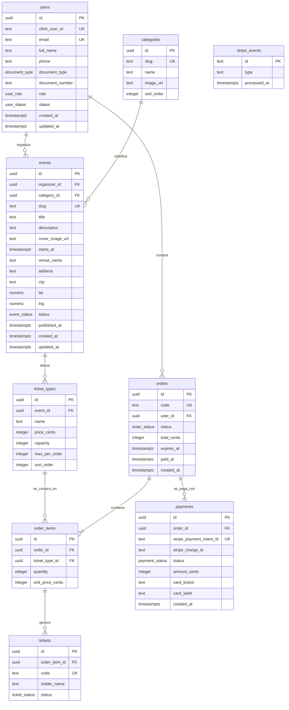

# MER de base de datos

Modelo entidad-relación de Ticktera, derivado de la UI del artifact de Claude Design: landing, búsqueda, detalle de evento, elegir zona, checkout, confirmación, mis entradas, login/registro, crear evento y dashboard de organizador. Es la referencia del schema Drizzle en `db/schema/` (Postgres: Neon en local, Cloud SQL en producción). El contexto de arquitectura está en [system-design.md](./system-design.md).

Convenciones:

- PK `uuid` con `defaultRandom()` (excepto `stripe_events`, cuya PK es el `event.id` de Stripe).
- Tiempos `timestamptz`.
- Montos en céntimos, `integer`. La moneda es `PEN` implícita: no hay columna de moneda.
- Las cantidades vendidas **no se almacenan**: se derivan de `order_items` de órdenes `paid` o `pending` vigentes.

## Diagrama

Notas del diagrama: `ticket_types` tiene además único compuesto `(event_id, name)`. `stripe_events` no tiene relaciones: solo sirve de registro de idempotencia para los webhooks de Stripe.

## Enums

Definidos en `db/schema/enums.ts`.

| Enum | Valores |
| ---- | ------- |
| `user_role` | `super_admin`, `admin`, `organizer`, `customer` |
| `user_status` | `active`, `suspended` |
| `document_type` | `dni`, `ce`, `passport` |
| `event_status` | `draft`, `published`, `cancelled`, `suspended` |
| `order_status` | `pending`, `paid`, `expired`, `refunded` |
| `ticket_status` | `valid`, `used`, `void` |
| `payment_status` | `pending`, `succeeded`, `failed`, `refunded` |

## Diccionario

Todas las tablas tienen `id uuid` PK NOT NULL (`defaultRandom()`), salvo `stripe_events`. Columnas NOT NULL salvo que se marque `?`. Las FK sin `on delete` explícito usan el comportamiento por defecto de Postgres (`no action`): no se borran filas con hijos.

### `users`

Cuenta local espejo del usuario de Clerk. La usan login/registro y todas las pantallas que muestran datos del comprador u organizador.

| Columna | Tipo | Null | Default | Notas |
| ------- | ---- | ---- | ------- | ----- |
| `clerk_user_id` | text | no | - | Único. Enlaza con Clerk. |
| `email` | text | no | - | Único. |
| `full_name` | text | no | - | Nombre del checkout y de "Mis entradas". |
| `phone` | text | sí | - | Dato de contacto del checkout. |
| `document_type` | `document_type` | sí | - | DNI, CE o pasaporte del checkout. |
| `document_number` | text | sí | - | Número del documento. |
| `role` | `user_role` | no | `customer` | Fuente de verdad del rol (espejo en Clerk `publicMetadata.role`). |
| `status` | `user_status` | no | `active` | `suspended` bloquea la cuenta (admin o borrado en Clerk). |
| `created_at` | timestamptz | no | `now()` | |
| `updated_at` | timestamptz | no | `now()` | |

Únicos: `clerk_user_id`, `email`.

### `categories`

Categorías de la landing y de los filtros de búsqueda; el select de "Crear evento".

| Columna | Tipo | Null | Default | Notas |
| ------- | ---- | ---- | ------- | ----- |
| `slug` | text | no | - | Único. Usado en URLs y filtros. |
| `name` | text | no | - | Etiqueta visible. |
| `image_url` | text | sí | - | Imagen de la tarjeta de categoría. |
| `sort_order` | integer | no | - | Orden de aparición. |

Únicos: `slug`.

### `events`

Evento publicado: tarjetas de landing y búsqueda, detalle, y formulario de "Crear evento". El venue va como campos del evento (sin tabla de venues).

| Columna | Tipo | Null | Default | Notas |
| ------- | ---- | ---- | ------- | ----- |
| `organizer_id` | uuid | no | - | FK → `users.id`. Dueño del evento. |
| `category_id` | uuid | no | - | FK → `categories.id`. |
| `slug` | text | no | - | Único. URL del detalle. |
| `title` | text | no | - | |
| `description` | text | sí | - | |
| `cover_image_url` | text | sí | - | Portada. |
| `starts_at` | timestamptz | no | - | Fecha y hora del evento. |
| `venue_name` | text | no | - | Nombre del lugar. |
| `address` | text | sí | - | Dirección en texto. |
| `city` | text | no | - | Filtro de ciudad en búsqueda. |
| `lat` | numeric | sí | - | Nulo si no hay Google Maps (local). |
| `lng` | numeric | sí | - | Idem. |
| `status` | `event_status` | no | `draft` | `draft` mientras se crea; `published` es visible al público. |
| `published_at` | timestamptz | sí | - | Se completa al publicar. |
| `created_at` | timestamptz | no | `now()` | |
| `updated_at` | timestamptz | no | `now()` | |

Único: `slug`. Índices: `(status, starts_at)` (listados públicos), `city`, `category_id`, `organizer_id` (dashboard del organizador).

### `ticket_types`

Zonas de "Elige tu zona" y "Tipos de entrada" de "Crear evento". Cada tipo es una zona con precio y aforo propios.

| Columna | Tipo | Null | Default | Notas |
| ------- | ---- | ---- | ------- | ----- |
| `event_id` | uuid | no | - | FK → `events.id`, `on delete cascade`. |
| `name` | text | no | - | Nombre de la zona (ej. "General", "VIP"). |
| `price_cents` | integer | no | - | Precio en céntimos de PEN. |
| `capacity` | integer | no | - | Aforo total del tipo. |
| `max_per_order` | integer | no | - | Tope de entradas por compra (selector de cantidad). |
| `sort_order` | integer | no | - | Orden en el selector de zonas. |

Único: `(event_id, name)`. CHECK: `capacity >= 0`, `price_cents >= 0`, `max_per_order > 0`.

### `orders`

Pedido del checkout y de la confirmación. Una orden `pending` con `expires_at` es la reserva temporal (sin tabla de holds).

| Columna | Tipo | Null | Default | Notas |
| ------- | ---- | ---- | ------- | ----- |
| `code` | text | no | - | Único. "Pedido N.º TK-24817". |
| `user_id` | uuid | no | - | FK → `users.id`. Compra solo con cuenta. |
| `status` | `order_status` | no | `pending` | |
| `total_cents` | integer | no | - | Total cobrado en céntimos. |
| `expires_at` | timestamptz | no | - | "Reservamos tus entradas por…". |
| `paid_at` | timestamptz | sí | - | Se completa al confirmar el pago. |
| `created_at` | timestamptz | no | `now()` | |

Único: `code`. Índices: `(status, expires_at)` (job de vencimiento y conteo de pendientes vigentes), `user_id` ("Mis entradas"). CHECK: `total_cents >= 0`.

### `order_items`

Línea de una orden: cuántas entradas de un tipo y a qué precio.

| Columna | Tipo | Null | Default | Notas |
| ------- | ---- | ---- | ------- | ----- |
| `order_id` | uuid | no | - | FK → `orders.id`, `on delete cascade`. |
| `ticket_type_id` | uuid | no | - | FK → `ticket_types.id`. |
| `quantity` | integer | no | - | Cantidad comprada. |
| `unit_price_cents` | integer | no | - | Precio congelado al comprar: cambiar el precio del tipo no altera órdenes previas. |

CHECK: `quantity > 0`. Índices: `order_id`, `ticket_type_id` (conteo de vendidas por tipo).

### `tickets`

Entrada individual emitida al pagar: una fila por unidad de `order_items.quantity`.

| Columna | Tipo | Null | Default | Notas |
| ------- | ---- | ---- | ------- | ----- |
| `order_item_id` | uuid | no | - | FK → `order_items.id`, `on delete cascade`. |
| `code` | text | no | - | Único. Código de la entrada (QR en "Mis entradas"). |
| `holder_name` | text | no | - | "Titular" de "Mis entradas". Por defecto el comprador (A8). |
| `status` | `ticket_status` | no | `valid` | `void` al reembolsar. |

Único: `code`. Índice: `order_item_id`.

### `payments`

Intento de cobro con Stripe (tarjeta, `PEN`). Una orden puede tener varios (reintentos).

| Columna | Tipo | Null | Default | Notas |
| ------- | ---- | ---- | ------- | ----- |
| `order_id` | uuid | no | - | FK → `orders.id`. |
| `stripe_payment_intent_id` | text | no | - | Único. Liga el pago con el webhook. |
| `stripe_charge_id` | text | sí | - | Se completa al cobrar. |
| `status` | `payment_status` | no | `pending` | |
| `amount_cents` | integer | no | - | Monto en céntimos. |
| `card_brand` | text | sí | - | Marca para el resumen de confirmación. |
| `card_last4` | text | sí | - | Últimos 4 dígitos para el resumen de confirmación. |
| `created_at` | timestamptz | no | `now()` | |

Único: `stripe_payment_intent_id`. Índice: `order_id`.

### `stripe_events`

Registro de idempotencia de webhooks: si el `event.id` ya está, el evento se ignora. Sin pantalla asociada.

| Columna | Tipo | Null | Default | Notas |
| ------- | ---- | ---- | ------- | ----- |
| `id` | text | no | - | PK. Es el `event.id` de Stripe. |
| `type` | text | no | - | Tipo de evento de Stripe. |
| `processed_at` | timestamptz | no | `now()` | |

PK = `id`.

## Reglas de negocio derivadas del modelo

- **Disponibilidad** de un tipo = `capacity` − vendidas − pendientes vigentes. Vendidas = suma de `order_items.quantity` de órdenes `paid`. Pendientes vigentes = suma de órdenes `pending` con `expires_at` en el futuro.
- **"Agotado" y "Últimas entradas"** se calculan al consultar a partir de la disponibilidad. Nunca se guardan.
- **KPIs del dashboard de organizador** (vendidas, ingresos, publicados) son consultas sobre estas tablas. No hay tablas de resumen.
- **"Desde S/ X"** = mínimo de `ticket_types.price_cents` del evento.
- **Usuario borrado en Clerk**: la fila de `users` queda `suspended`, no se borra. Sus órdenes se conservan.

## Supuestos

- **A7**: `categories` es tabla y no enum. El artifact tiene 8 categorías, la landing del repo 6, y el Super admin debe poder editarlas.
- **A8**: `holder_name` por defecto = comprador.
- **A9**: sin `audit_logs`, escaneo en puerta ni tabla de emails (ninguna pantalla los usa).

## Fuera del modelo por decisión

- Yape y PagoEfectivo: solo Stripe con tarjeta.
- Stripe Connect, comisiones y payouts: cobra solo la plataforma.
- Organizaciones y equipos: el usuario es el organizador.
- Tabla de holds: la reserva es una orden `pending` con `expires_at`.
- Venues reutilizables o con mapa de zonas: el venue son campos del evento y la zona es un tipo de entrada.
- Compra como invitado: `orders.user_id` es NOT NULL.
